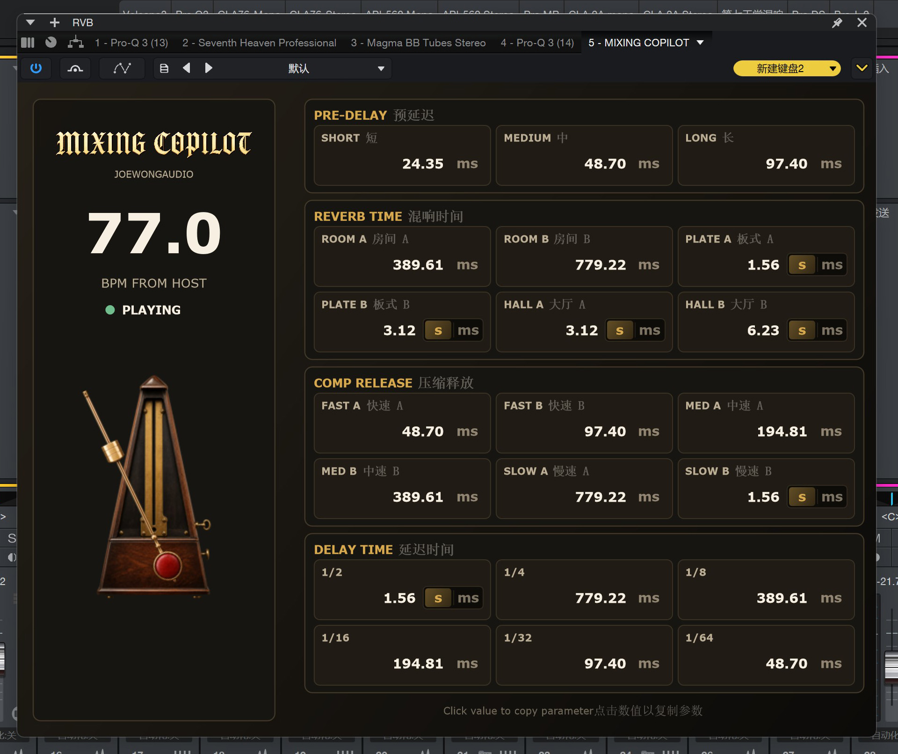

# MIXING COPILOT

MIXING COPILOT is a tempo-synchronized mixing assistant plugin developed by **JOEWONGAUDIO**. It reads the current BPM and transport state from the host DAW, then automatically converts the tempo into practical timing references for mixing and sound design.

MIXING COPILOT 是由 **JOEWONGAUDIO** 开发的节拍同步混音辅助插件。它从宿主 DAW 读取当前 BPM 和播放状态，并将音乐速度自动换算为适用于混音和声音设计的时间参数。



## Overview / 项目简介

MIXING COPILOT helps producers, mixing engineers, and sound designers translate musical tempo into useful audio-processing parameters. The plugin combines a refined vintage mechanical metronome with a compact timing reference panel for fast workflow decisions inside the DAW.

MIXING COPILOT 帮助制作人、混音工程师和声音设计师将音乐速度快速转换为实用的音频处理参数。插件结合了精致的复古机械节拍器和紧凑的时间参数参考面板，方便用户在 DAW 中快速完成混音决策。

The BPM value is read directly from the host transport. When playback is active, the pendulum animation follows the host tempo. When the host is stopped, the pendulum stops as well.

BPM 数值直接读取自宿主的传输控制。当宿主播放时，摆锤动画会跟随宿主速度同步摆动；当宿主停止时，摆锤也会停止。

## Features / 功能特点

- Host-synchronized BPM and transport-state display  
  宿主同步的 BPM 和播放状态显示
- Large real-time BPM readout  
  大号实时 BPM 数值显示
- Vintage mechanical metronome interface  
  复古机械节拍器界面
- BPM-synchronized pendulum animation  
  与 BPM 同步的摆锤动画
- Automatic pre-delay calculations with short, medium, and long references  
  自动计算短、中、长三档预延迟参数
- Room, plate, and hall reverb timing references  
  房间、板式和大厅三种混响空间时间参考
- Fast, medium, and slow compressor release references  
  快速、中速和慢速三档压缩释放时间参考
- Tempo-synchronized delay values from 1/2 to 1/64 notes  
  从 1/2 到 1/64 音符的节拍同步延迟参数
- Automatic conversion between milliseconds and seconds for longer values  
  较长参数可在毫秒和秒之间切换显示
- Two-decimal precision for all timing parameters  
  所有时间参数精确到小数点后两位
- Click any numeric value to copy only the number to the clipboard  
  点击任意数值即可仅复制数字到剪贴板
- Bilingual English and Chinese interface labels  
  中英双语界面标签
- VST3 support  
  支持 VST3
- Audio Unit support on macOS  
  macOS 支持 Audio Unit

## Timing Sections / 参数模块

### Pre-Delay / 预延迟

Provides short, medium, and long pre-delay references derived from the current BPM.

根据当前 BPM 提供短、中、长三档预延迟参考值。

### Reverb Time / 混响时间

Provides two timing references for each of the following spaces:

为以下每种混响空间提供两组时间参考值：

- Room A and Room B / 房间 A、房间 B
- Plate A and Plate B / 板式 A、板式 B
- Hall A and Hall B / 大厅 A、大厅 B

### Compressor Release / 压缩释放

Provides two release references for each speed range:

为以下每个速度档位提供两组释放时间参考值：

- Fast A and Fast B / 快速 A、快速 B
- Medium A and Medium B / 中速 A、中速 B
- Slow A and Slow B / 慢速 A、慢速 B

### Delay Time / 延迟时间

Provides beat-synchronized delay values for:

提供以下音符时值对应的节拍同步延迟参数：

- 1/2 note / 1/2 音符
- 1/4 note / 1/4 音符
- 1/8 note / 1/8 音符
- 1/16 note / 1/16 音符
- 1/32 note / 1/32 音符
- 1/64 note / 1/64 音符

## Behavior When BPM Is Unavailable / 无有效 BPM 时的行为

If the host reports a BPM of `0`, the plugin uses a 120 BPM reference tempo so that the timing sections continue to display useful baseline values. Once a valid host BPM becomes available, all values update automatically.

如果宿主报告的 BPM 为 `0`，插件会使用 120 BPM 作为默认基准速度，使各参数模块继续显示可用的参考数值。当宿主提供有效 BPM 后，所有参数会自动实时更新。

## Build Requirements / 构建要求

- C++17-compatible compiler / 支持 C++17 的编译器
- CMake 3.22 or newer / CMake 3.22 或更高版本
- JUCE 8.0.8 or newer / JUCE 8.0.8 或更高版本
- Xcode Command Line Tools on macOS / macOS 需要 Xcode Command Line Tools
- Visual Studio 2022 with Desktop development with C++ on Windows / Windows 需要安装 Visual Studio 2022 的“使用 C++ 的桌面开发”工作负载

## Build with CMake / 使用 CMake 构建

The project can download JUCE automatically through CMake:

项目可以通过 CMake 自动下载 JUCE：

```bash
cmake -S . -B build
cmake --build build --config Release
```

You can also provide a local JUCE checkout:

也可以指定本地 JUCE 源码目录：

```bash
cmake -S . -B build -DJUCE_PATH=/path/to/JUCE
cmake --build build --config Release
```

On Windows, use the Visual Studio generator:

在 Windows 上，请使用 Visual Studio 生成器：

```bat
cmake -S . -B build-windows -DJUCE_PATH=third_party/JUCE -G "Visual Studio 17 2022" -A x64
cmake --build build-windows --config Release
```

The Windows VST3 output is expected at:

Windows VST3 输出文件位于：

```text
build-windows\MixingCopilot_artefacts\Release\VST3\MIXING COPILOT.vst3
```

## Windows Installer / Windows 安装包

Install Inno Setup 6, then compile the installer script:

安装 Inno Setup 6 后，编译安装脚本：

```bat
"C:\Program Files (x86)\Inno Setup 6\ISCC.exe" Packaging\Windows\MIXING_COPILOT_Windows_InnoSetup.iss
```

The installer is written to:

安装包输出位置：

```text
Packaging\Dist\Windows\MIXING COPILOT Windows VST3 Installer.exe
```

## Downloads / 下载

Prebuilt Windows binaries are kept separately from the source tree. The Windows release folder contains a native x64 VST3 build and an Inno Setup installer.

Windows 预编译文件与源码分开保存。Windows 发布目录包含原生 x64 VST3 版本和 Inno Setup 安装包。

For end users, use the installer from the GitHub or Gitee Releases page. The standalone VST3 bundle can also be copied to:

普通用户请从 GitHub 或 Gitee 的 Releases 页面下载安装包。单独的 VST3 文件夹也可以复制到：

```text
C:\Program Files\Common Files\VST3
```

Only the `.vst3` bundle and the installer should be published as release assets. Visual Studio `.lib` and `.exp` files are intermediate build artifacts and should not be uploaded.

发布时只需要上传 `.vst3` 文件夹和安装包。Visual Studio 生成的 `.lib` 和 `.exp` 文件属于中间构建产物，不应上传。

## Project Structure / 项目结构

```text
Source/                 Plugin processor and editor source / 插件处理器和界面源码
Assets/                 Interface images and visual resources / 界面图片和视觉资源
Packaging/Windows/      Windows installer script / Windows 安装脚本
CMakeLists.txt          Cross-platform JUCE/CMake configuration / 跨平台配置
```

## AAX Status / AAX 状态

The project contains build configuration notes for AAX, but an AAX build requires the proprietary Avid AAX SDK. The SDK is not included in this repository and must be obtained and configured separately by the developer.

项目中包含 AAX 构建配置说明，但构建 AAX 版本需要 Avid 专有的 AAX SDK。本仓库不包含该 SDK，开发者需要自行获取并配置。

## Licensing / 许可证

The project source and original visual assets should be released under a license selected by the copyright holder. JUCE remains subject to its own licensing terms. Do not redistribute the Avid AAX SDK.

项目源码和原创视觉资源应根据版权所有者选择的许可证发布。JUCE 仍须遵守其自身的授权条款。请勿重新分发 Avid AAX SDK。

## Vendor / 厂商

**JOEWONGAUDIO**
